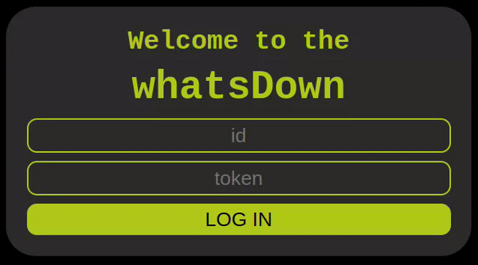
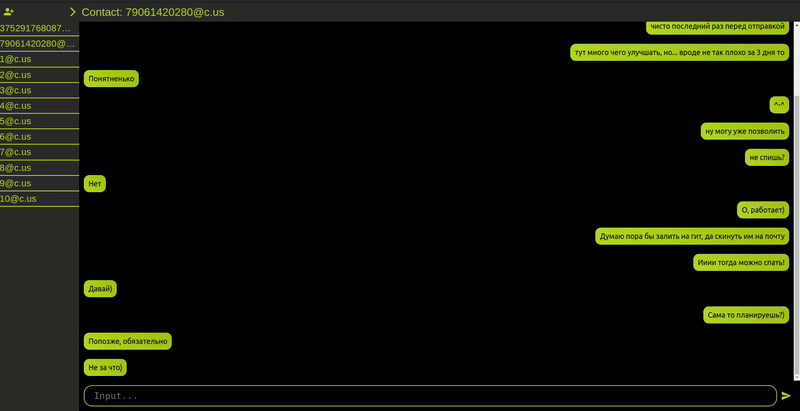
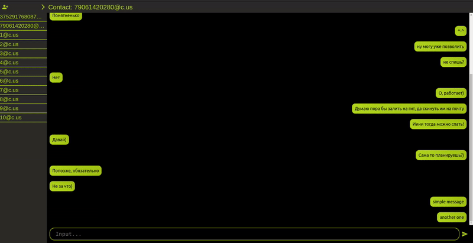

# Simple chat React App: whatsDown
Небольшое клиентское приложение, выполненное как тестовое задание. Приложение позволяет отправлять и получать сообщения через Green Api для мессенджера WhatsApp.
## Стэк:
Frontend: React (TS). <br/>
* Для удобного хранения и обращения с сообщениями используется Redux.
* Как вспомогательная библиотека используется [MUI](https://mui.com/). 
* Основная стилизация задана с помощью CSS.
## Архитектура клиента:
Общение с whatsApp происходит только по средствам работы с [GreenAPI](https://green-api.com/). 
* **Отправка сообщений**. Реализована с помощью запроса [SendMessage](https://green-api.com/docs/api/sending/SendMessage/).
Сообщение отправляется, после чего ожидается ответ от API. В случае успеха сообщение сохраняется локально. 
* **Получение сообщений**. Реализовано с помощью запроса [ReceiveNotification](https://green-api.com/docs/api/receiving/technology-http-api/). Запрос о наличии новых оповещений регулярно посылается к API, после обработки предыдущего. Более экономно использовать socket'ы или webHook'и. Но в рамках поставленного ТЗ реализовать это невозможно. 
* **Сохранение сообщений**. Как и других данных, происходит с помощью localStorage. Для удобной работы с объектами localStorage используется Redux. 
## Локальный запуск:
Установка модулей и запуск:
```
npm install && npm run start 
```
Сборка и запуск:
```
npm run build && npx serve -s build
```
## Showcase:



